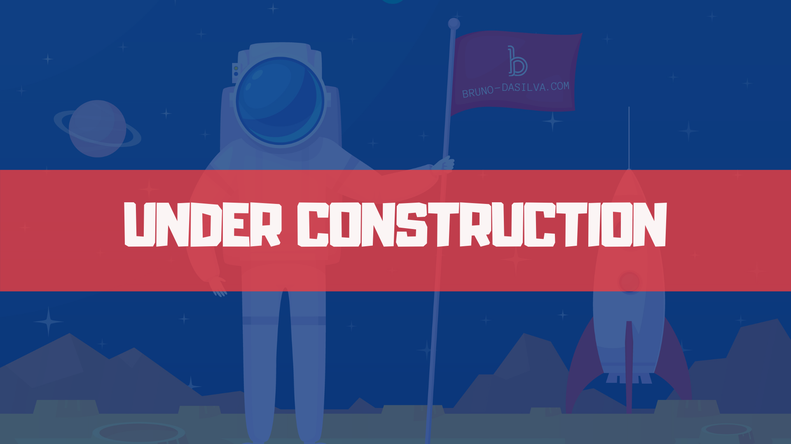
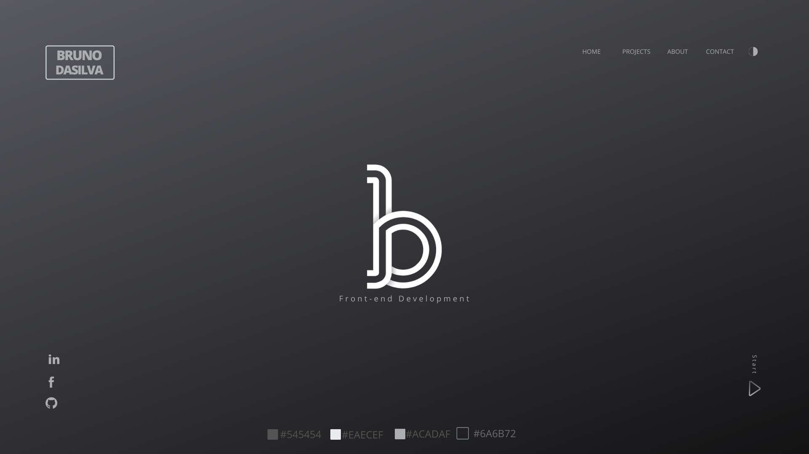
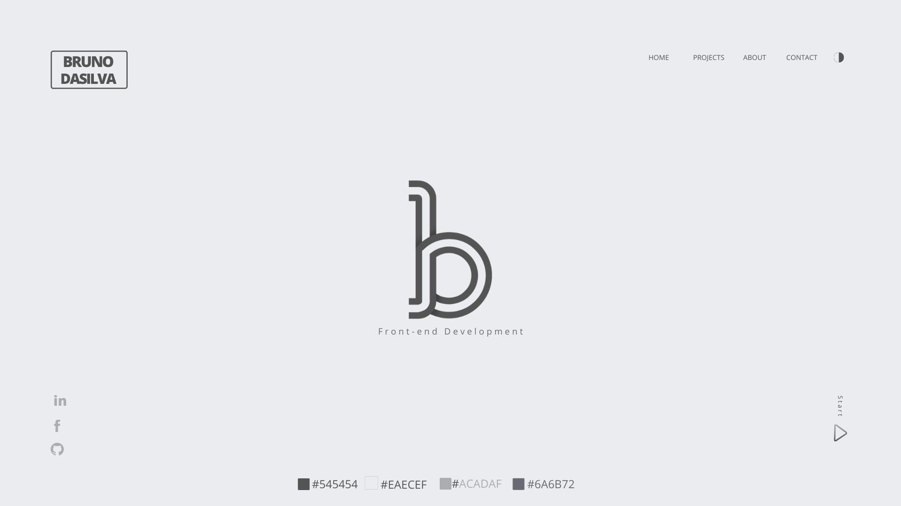

# Bruno-Dasilva.com

I am re-designing my portfolio http://www.bruno-dasilva.com/

---

---

### Goals:

    - Convert it to ReactJS
    - Include new projects from GA's bootcamp
    - Add relevant information regarding career goals, changes, and about Me
    - Explorer new technologies, design, and a clean approach

---

### Application Design:

##### Landing Page Design

---

### Application Development:

---

### Tools :

    - ReactJS
    - JSX
    - Canva.com
    - Adobe Illustrator

---

##### Demos : http://www.bruno-dasilva.com/

---

This project was bootstrapped with [Create React App](https://github.com/facebook/create-react-app).
