# Bruno-Dasilva.com

### Application Development:

My goal since the beginning was to provide a simplistic layout with a modern responsive design to it. So, I decided to go for a wide overflow hidden layout, like a canvas style, where I could focus on the user experience providing the users free form distractions and a clean layout approach.

The dark mode was one of my goals and with the UseState hook it made my life super easy where I could setDarkMode based on conditional rendering. 

I decided to dig in React Springs and React in general, in order to challenge myself and learn something new while re-branding and re-creating my portfolio. 

Among many challenges, understanding the core concept of React Springs was, without a shadow of doubt one of the most difficult aspects, however, once I started it was so addictive that I had to control myself and not animate every single portion of my site. My favorite part was a was the Tree menu that I used to display my Resume information in the About me sections. 

---

### Tools :

    - ReactJS
    - React Reach Router
    - React Spring
    - JSX
    - EmailJS
    - FontAwesome
    - Canva.com
    - Adobe Illustrator
    

---

### Performance: 

#### Light House Audit: 

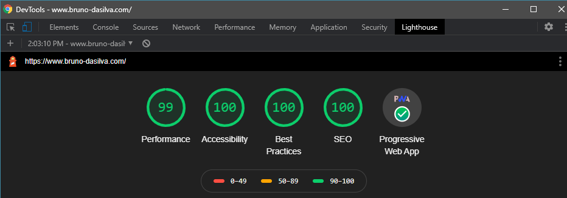

---

##### Demos : http://www.bruno-dasilva.com/

---

### Goals:

    - Convert it to ReactJS
    - Include new projects from GA's bootcamp
    - Add relevant information regarding career goals, changes, and about Me
    - Explorer new technologies, design, and a clean approach

---

### Application Design:

These were the very first design I decided to put it here to demonstrate a little bit about my process thought and how I accomplished the final design. For me, it is extremely important to have a pre-set design, guidance so I can focus on the end goal. One thing to notice is that I am not super restricted with the final piece, as you might notice a couple of things have changed since the very first draft. 

#### First Design

#### Dark Mode: 

#### Light Mode: 

---

#### Final Portfolio Design

##### Home Page

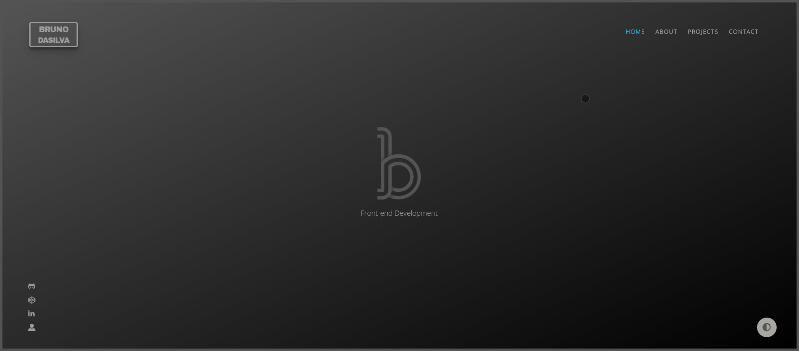

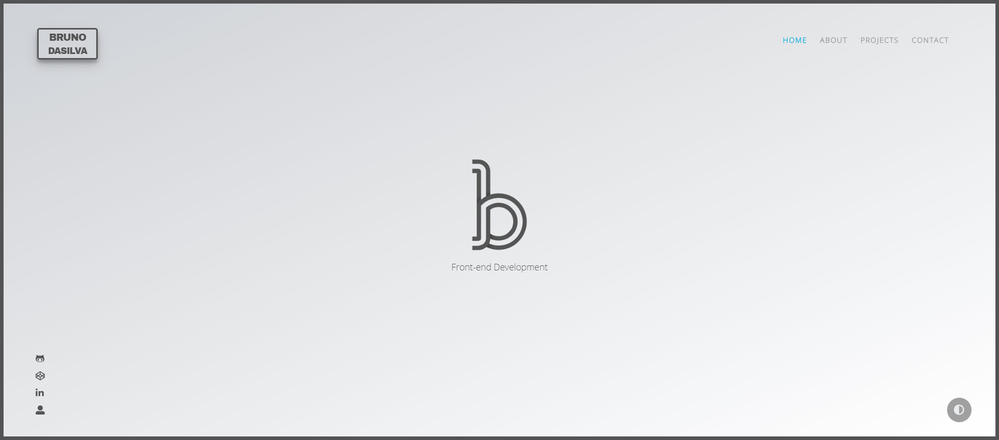

---

##### About

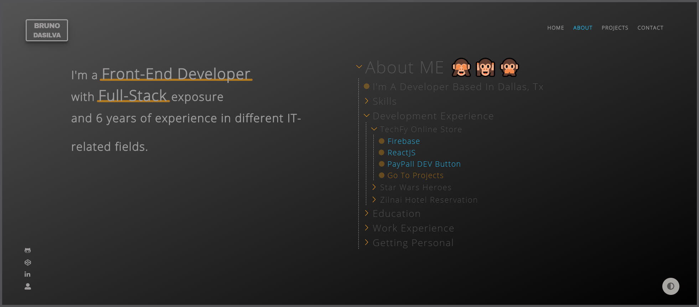

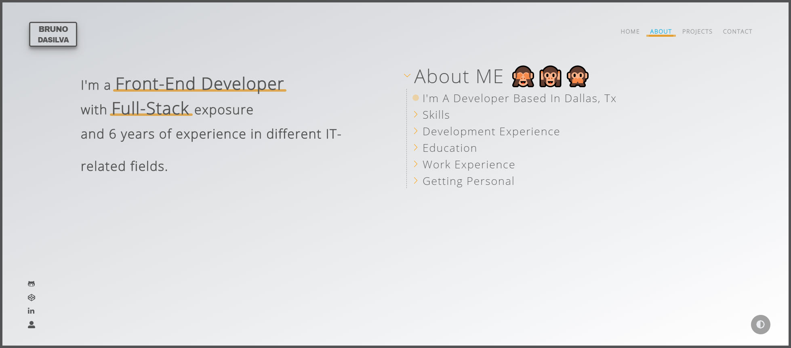

---

##### Projects

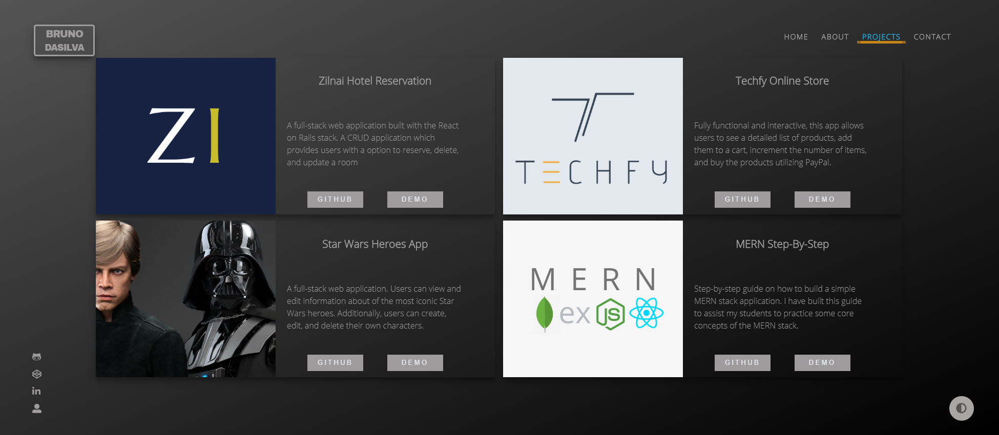

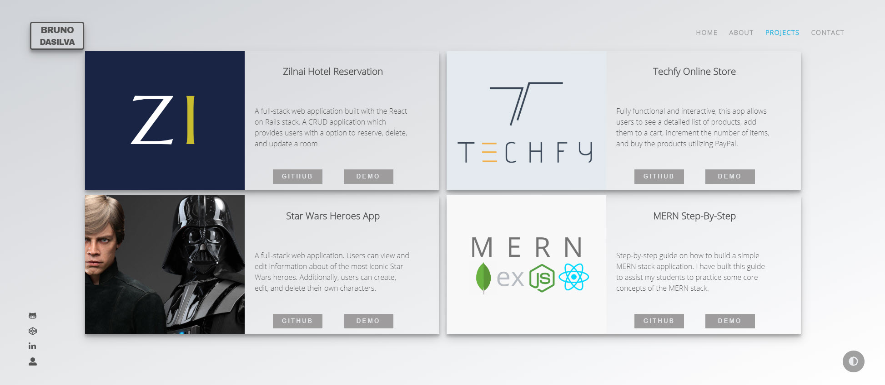

---

##### Contact

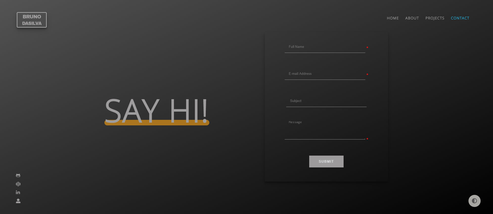

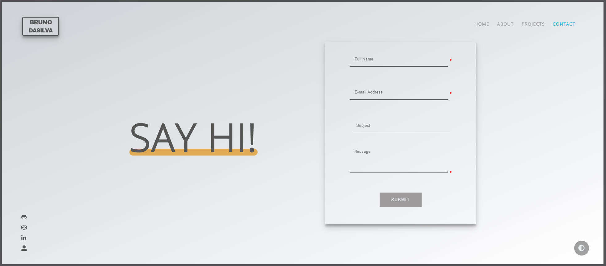

---

##### Mobile

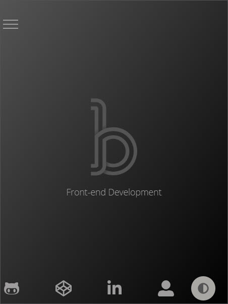

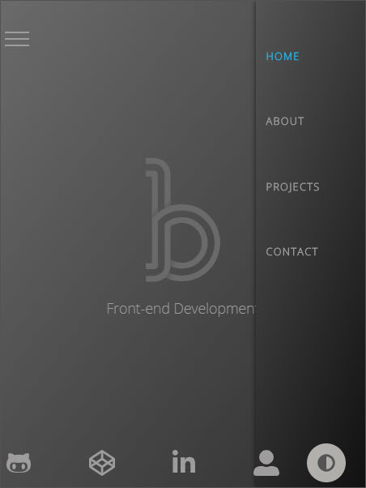

---

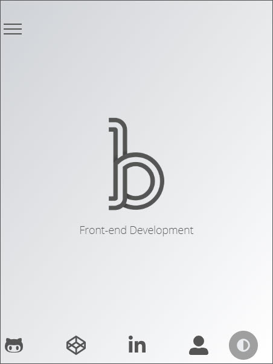

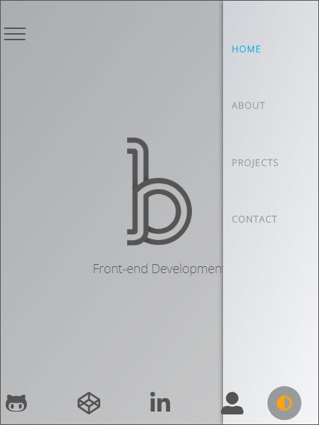

---

##### See more at http://www.bruno-dasilva.com/

---

This project was bootstrapped with [Create React App](https://github.com/facebook/create-react-app).
